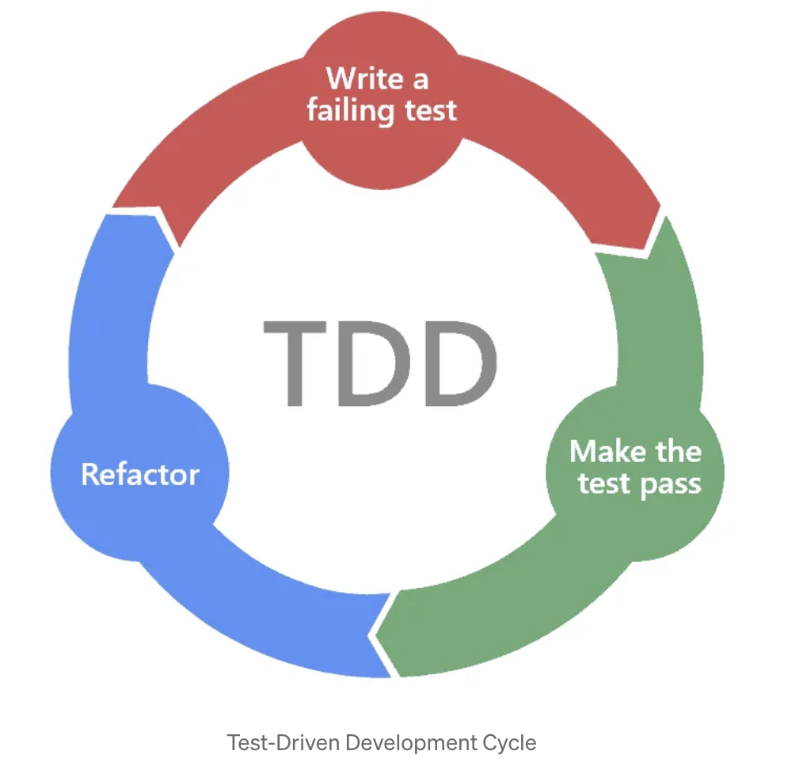
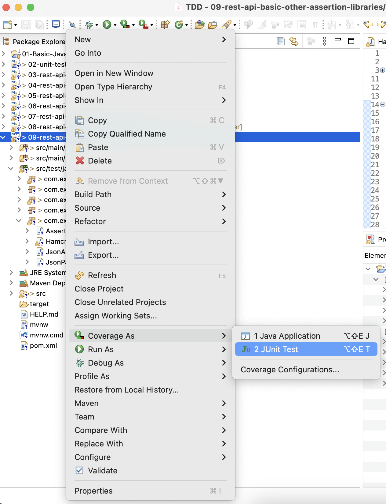
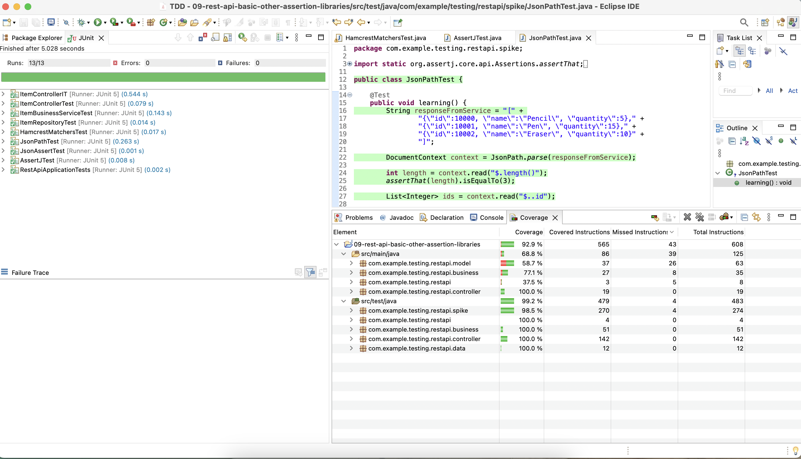

# TDD
Test Driven Development

Test-Driven Development (TDD) is a software development approach that emphasizes writing tests before writing the actual code. This methodology has gained popularity for its ability to improve code quality, enhance maintainability, and facilitate efficient collaboration among development teams.

## Red-Green-Refactor flow

TDD is a software development process that follows a cyclic pattern: Red-Green-Refactor. This cycle involves the following steps:

1. **Red**: Write a failing test for the specific functionality you’re about to implement. This test should demonstrate that the desired behavior is not currently present in the code.

2. **Green**: Write the minimum amount of code necessary to make the failing test pass. The goal is to achieve a passing test, indicating that the new functionality has been successfully added.

3. **Refactor**: Once the test passes, refactor the code to improve its design and maintainability. This step ensures that the code remains clean and well-structured.

## JUnit
JUnit is a unit testing framework designed for Java programming language.

## Code Coverage

